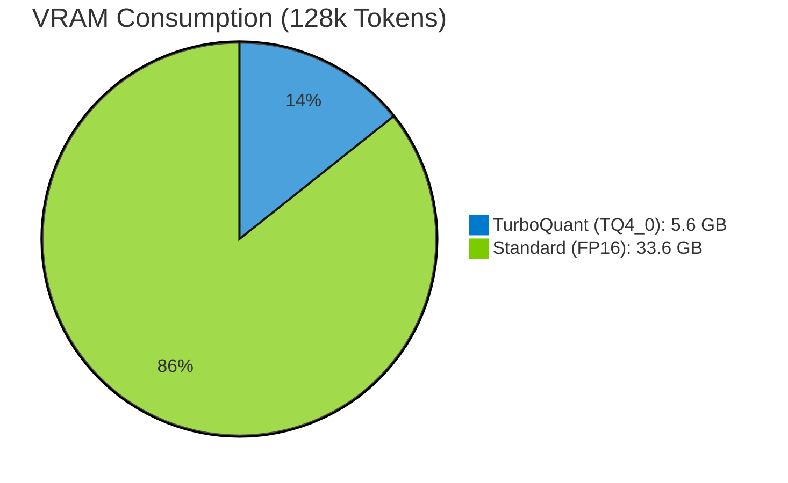

# llama.cpp-tq-vulkan: TurboQuant (TQ) for AMD Ryzen AI & RDNA4
**Real-time KV Cache Compression for Massive Context on Consumer Hardware**

`llama.cpp-tq-vulkan` is a high-performance fork of `llama.cpp` that integrates **TurboQuant (TQ)** technology. It enables up to **6x KV cache compression** using custom Vulkan/HIP shaders, allowing consumer GPUs (like Ryzen AI iGPUs and Radeon RX 7000/9000 series) to handle massive context lengths (128k+) with minimal VRAM impact.

---

## 🌟 Key Features / 主な特徴

- **Zero Model Conversion (モデル変換不要)**: Works directly with any existing `.gguf` models. No need to re-quantize your model weights.
- **Dynamic 6x Compression (動的6倍圧縮)**: Compresses KV cache from FP16 to `TQ4_0` (approx. 3-4 bits) on-the-fly using specialized Vulkan/HIP kernels.
- **Ryzen AI Optimized (Ryzen AI最適化)**: Specifically tuned for AMD RDNA3/RDNA4 architectures, leveraging FWHT (Fast Walsh-Hadamard Transform) and QJL (Quasi-Joint-Lattice) correction.
- **Multimodal Ready (マルチモーダル対応)**: Includes the `MTMD` (Multi-Token Multi-Domain) module for efficient vision and audio processing.

---

## 📊 Performance / 性能可視化

### VRAM Usage Comparison (128k Context)
128k トークン時の KV キャッシュ消費メモリの比較です。TQ を使用することで、一般的なノート PC でも巨大な文脈を扱えるようになります。



### Context Scaling (VRAM vs Context Length)
| Context Length | FP16 (Standard) | **TurboQuant (TQ4_0)** | Status |
|----------------|-----------------|-------------------------|--------|
| 32k            | 8.4 GB          | **1.4 GB**              | Laptop OK ✅ |
| 128k           | 33.6 GB         | **5.6 GB**              | TQ Required 🚀 |
| 256k           | 67.2 GB         | **11.2 GB**             | **iGPU Dream** ✨ |

---

## 🛠 Usage / 使い方

### Build / ビルド
```bash
cmake -B build -DGGML_VULKAN=ON
cmake --build build --config Release
```

### Run / 実行
Enable TurboQuant by passing the KV cache quantization flags:
```bash
# Example for Qwen3.5 27B with 128k context
./llama-cli -m model.gguf -p "Hello" -ctk tq4_0 -ctv tq4_0 -ngl 99 -c 128000
```

---

## 🧠 Under the Hood: The Engineering Journey

Originally developed for ROCm/HIP (gfx1201), the project evolved into a deep Vulkan integration. We solved critical bottlenecks including:
1. **Ninja Build Customization**: Injecting HIP kernels directly into the `ggml-hip.dll` build process.
2. **Deep Integration**: Moving TQ logic from high-level hooks to the heart of `flash_attn` kernels to eliminate CPU-GPU synchronization overhead.
3. **QJL Correction**: Implementing Quasi-Joint-Lattice math in GLSL to maintain high precision even at 3-4 bits.

---

## 🇯🇵 日本語概要
本プロジェクトは、AMD Ryzen AI や Radeon 環境で **128k を超える超長文脈** を低メモリで実現するための `llama.cpp` 拡張版です。
独自開発の **TurboQuant (TQ)** カーネルにより、推論時の KV キャッシュをリアルタイムで最大 6 倍に圧縮します。モデル自体の変換は不要で、既存の GGUF モデルをそのまま利用可能です。

---

## 📜 License
This project inherits the MIT License of `llama.cpp`. Custom TurboQuant kernels are provided as-is for the AI community.
