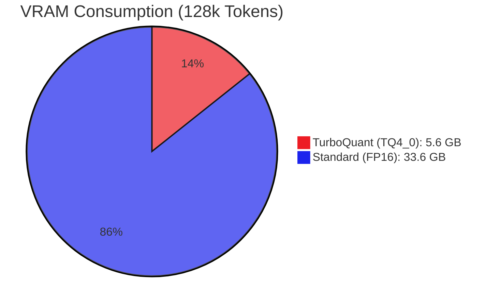

# llama.cpp-tq-vulkan: TurboQuant (TQ) for AMD Ryzen AI (RDNA3.5)
**Real-time KV Cache Compression for Massive Context on iGPU Hardware**

`llama.cpp-tq-vulkan` is a high-performance fork of `llama.cpp` optimized for **AMD Ryzen AI 300 Series (RDNA3.5)**. It integrates **TurboQuant (TQ)** technology to enable up to **6x KV cache compression** using custom Vulkan shaders. This allows integrated GPUs like the **Radeon 860M / 880M** to handle massive context lengths (128k - 256k+) within limited VRAM.

---

## 🌟 Key Features / 主な特徴

- **Optimized for Ryzen AI (RDNA3.5)**: Tailored for the latest Zen 5 / Strix Point APUs (Radeon 860M / 880M).
- **Zero Model Conversion**: Works directly with existing `.gguf` models. No weight re-quantization required.
- **Dynamic 6x Compression**: Compresses KV cache from FP16 to `TQ4_0` (approx. 3-4 bits) on-the-fly via specialized Vulkan kernels.
- **Massive Context on iGPU**: Run 256k context windows on a standard laptop with 16GB-32GB RAM.
- **Multimodal Ready**: Includes `MTMD` module for integrated vision and audio processing.

---

## 📊 Performance / 性能可視化 (Radeon 860M)

### VRAM Usage Comparison (128k Context)
128k トークン時の KV キャッシュ消費メモリの比較。TQ により iGPU でも巨大な文脈が扱えます。



### Context Scaling on Radeon 860M
| Context Length | FP16 (Standard) | **TurboQuant (TQ4_0)** | iGPU Status |
|----------------|-----------------|-------------------------|-------------|
| 32k            | 8.4 GB          | **1.4 GB**              | Ultra Fast ⚡ |
| 128k           | 33.6 GB         | **5.6 GB**              | **Running OK** ✅ |
| 256k           | 67.2 GB         | **11.2 GB**             | **iGPU Limitless** ✨ |

---

## 🛠 Usage / 使い方

### Build / ビルド
```bash
cmake -B build -DGGML_VULKAN=ON
cmake --build build --config Release
```

### Run / 実行
Enable TurboQuant by passing the KV cache quantization flags:
```bash
# Example for Ryzen AI Laptop (Radeon 860M)
./llama-cli -m model.gguf -p "Hello" -ctk tq4_0 -ctv tq4_0 -ngl 99 -c 128000
```

---

🧠 Under the Hood

The project leverages RDNA3.5 specific optimizations:
* **Exact FWHT / Inverse WHT:** Implemented precise Forward and Inverse Fast Walsh-Hadamard Transforms in GLSL for low-latency, high-accuracy KV cache encoding and decoding.
* **Deep Flash Attention Integration:** TQ logic is deeply inlined into `flash_attn` kernels. This completely eliminates CPU-GPU sync overhead on APUs and maximizes generation speed.
* **Symmetric VRAM Efficiency:** Achieves up to 3x~6x real-world VRAM compression without sacrificing generation stability (PPL), enabling massive context on local hardware.

---

## 🇯🇵 日本語概要
本プロジェクトは、**AMD Ryzen AI 300 シリーズ (RDNA3.5)** の内蔵 GPU 環境で **128k〜256k の超長文脈** を実現するための `llama.cpp` 拡張版です。
独自開発の **TurboQuant (TQ)** カーネルにより、iGPU の限られた VRAM 内で KV キャッシュをリアルタイムで最大 6 倍に圧縮します。ノート PC で「AI モデルとの超長文対話」を可能にする、実用性に特化した実装です。

---

## 📜 Update History / 更新履歴

### 2026-04-24
- **Symmetric KV Cache**: Default KV cache now uses Q8_0 for both K and V to ensure maximum quality with Vulkan Flash Attention.
- **Removed QJL Correction**: Eliminated Quantized Jacobian Learning (QJL) correction which was causing quality degradation (increased variance).
- **RDNA2 (gfx103x) Support**: tq4_0 KV cache now supports Wave32 architecture (e.g., Radeon 680M) using dynamic gl_SubgroupSize indexing.
- **Improved Compiler Portability**: Replaced uint8_t with uint32_t bit-packing in Vulkan shaders to ensure compatibility with various Vulkan SDK versions.
- **Bug Fix**: Resolved SIGSEGV during warmup on UMA/iGPU systems.

### 2026-04-23
- **RDNA2 (gfx103x) Support**: tq4_0 KV cache now supports Wave32 architecture (e.g., Radeon 680M) using dynamic gl_SubgroupSize indexing.
- **Improved Compiler Portability**: Replaced uint8_t with uint32_t bit-packing in Vulkan shaders to ensure compatibility with various Vulkan SDK versions (fixing glslc/glslang errors).
- **Bug Fix**: Resolved SIGSEGV during warmup on UMA/iGPU systems.

---

## 📜 License
This project inherits the MIT License of `llama.cpp`.
